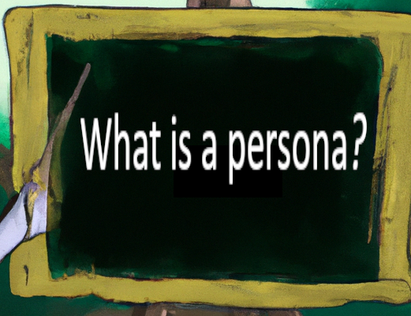
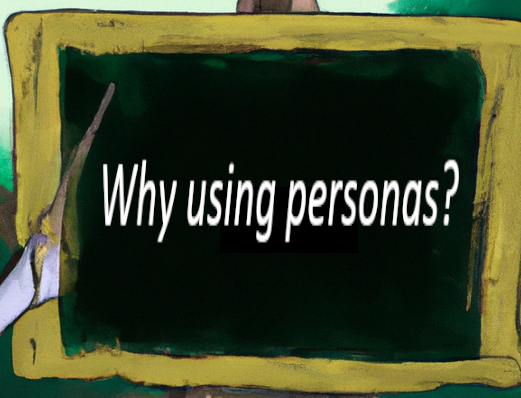

<!--

author:   Britta Petersen
email:    b.petersen@rz.uni-kiel.de
version:  1.0
language: en
narrator: UK English Female

icon:     images/dalia-logo.png

comment:  This document provides a brief introduction to research data management for lecturers. It provides an overview of rdm related topics as well as some didactic and methodologies for teaching rdm to students.

-->

# Speed-Dating with EduTrain personas

## Section Training & Education and DALIA
The NFDI Section Training & Education aims to raise awareness of research data management and to promote competences in this area in order to support the quality and sustainability of research results.
---

**The Section's paradigm is**: <big>**data literacy from the start!**</big>

--> Thus the work of the section is relevant to a wide range of target groups.
---

The [DALIA (Data Literacy Alliance)](https://dalia.education/) project is part of the sections activities. It contributes to the implementation of the section´s paradigm by developing a platform for teaching and learning materials in the field of research data management.
---

## What is a persona?

> <!-- width="100px" align="right" -->
>
>The **persona method** has its **origin** in the field of **software development** and was and still is used for optimizing **human-computer-interactions**.
>
>Today the method is used for various purposes in different fields, most notably in design, marketing, and user-centered development processes.

> “Personas are user archetypes that characterise the needs, goals, technical experience, accessibility requirements and other personal characteristics of larger groups of people.”
>
> -- [Mariana Lilley, Andrew Pyper & Sue Attwood (2012)](https://doi.org/10.11120/ital.2012.11010004)

> “A persona is a fictional character built that models actual users. It’s not a real person; however, it’s built on common characteristics that your learners share.”
>
> -- [Huprich (2019)](https://medium.com/@juliahuprich/building-learner-personas-for-instructional-design-effectiveness-8787d4e5d1d2)

> “The idea: Instead of assuming an anonymous mass, people with concrete names, professions, hobbies, habits, values, etc. are created.”
>
> -- [NFDI4Biodiversity](https://www.nfdi4biodiversity.org/en/personas/)

## Why personas?

>**Personas can in general can help us in developing, maintaining and improving EduTrain services**:
>
> <!-- width="100px" align="right" -->
>
>-> **User-Centered Design**: Personas can help to design services, systems and learning offers, having the end users in mind. By creating detailed and relatable profiles of target users, we can better understand user needs, behaviors, and preferences.
>
>->  **Empathy and Understanding**: Personas provide a human face to abstract user groups. They can help us to empathize with users and their goals, motivations and pain points, leading to better designs and decision-making.
>
>-> **Communication**: Personas can simplify communication. Instead of referring to vague user groups, personas provide a concrete reference point. They can enable us to share a common understanding of who the users are and what they want. Personas can also be used to tailor messages and campaigns to specific user groups.
>
>-> **Prioritization**: We may identify primary, secondary, and tertiary user types. This might help us to prioritize features, functionalities, and improvements based on the needs and goals of the most important user segments.
>
>-> **Testing and Validation**: Personas can be used to guide usability testing and validation efforts. Thus personas can be used to create realistic scenarios for testing, ensuring that user interactions and feedback are relevant to the intended audience.
>
>-> **Cross-Functional Collaboration**: Personas may also help in encouraging collaboration as shared personas ensure everyone works towards a common understanding of the user base.

## Existing personas in NFDI consortia

Some NFDI consortia have already worked on personas or archaetypes to decribe their users.

The cosortia focus on subject-specific needs and interests, while the EduTrain section with its activities is active across different disciplines and focuses education and training needs in the field of data management. Personas or archaetypes decribed by consortia are also possible users of the section training and education.

><big>**Have a look at them here:**</big>
>
>* [NFDI4Biodiversity](https://www.nfdi4biodiversity.org/en/personas/)
>
>* [NFDI4Ing](https://nfdi4ing.de/archetypes/)
>
>* NFDI4DataScience
>
>**If you are aware of more existing personas/archaetypes within other NFDI consortia, please leave us a note *(preferably with a link to the resource or a contact)* at the general comment section of the persona [miro-Board](https://miro.com/app/board/uXjVMptzbjA=/?moveToWidget=3458764563028176872&cot=14)!**

## EduTrain: Main User Groups

The user group of the section EduTrain and DALIA is diverse. We expect users, from students to PIs, as well as from lecturers to research support staff working at libraries and computer centers or administrative areas.

Due to time constraints, we have reduced the number of user groups to three main groups, of which we would like you to help describe one representative at a time:

1. [**Learners**](https://miro.com/app/board/uXjVMptzbjA=/?moveToWidget=3458764563238869741&cot=14)
2. [**Lecturers**](https://miro.com/app/board/uXjVMptzbjA=/?moveToWidget=3458764563729042924&cot=14)
3. [**Assistants**](https://miro.com/app/board/uXjVMptzbjA=/?moveToWidget=3458764563729192386&cot=14)

Please visit our Miro-Board and help us to 

1. describe the main user groups, by naming all subgroups who you can think of may fit to the three main user groups, assign existing personas from NFDI consortia
2. leave characterising notes and comments to describe one persona as a representive for each main user group

>Please help us to describe personas/archetypes that characterise the needs, goals, technical experience, accessibility requirements and other personal characteristics of the EduTrain main user groups and take some time to meet them!
>
> --

>
<big>**Thanks a lot for participating!**</big>

### Learners 
Please collect user groups, we can consider to be learners on top of the Miro-Board space. If you are aware of existing personas from NFDI consortia, please assign them there, too. 

Please help to describe a learner!

<iframe src="https://miro.com/app/board/uXjVMptzbjA=/?moveToWidget=3458764563238869741&cot=14" style="border:0px;width:100%;height:500px" allowfullscreen="true" webkitallowfullscreen="true" mozallowfullscreen="true"></iframe>

### Lecturers
Please collect user groups, we can consider to be lecturers on top of the Miro-Board space. If you are aware of existing personas from NFDI consortia, please assign them there, too. 

Please help to describe a lecturer!

<iframe src="https://miro.com/app/board/uXjVMptzbjA=/?moveToWidget=3458764563729042924&cot=14" style="border:0px;width:100%;height:500px" allowfullscreen="true" webkitallowfullscreen="true" mozallowfullscreen="true"></iframe>

### Assistants
Please collect user groups, we can consider to be assistants on top of the Miro-Board space. If you are aware of existing personas from NFDI consortia, please assign them there, too. 

Please help to describe an assistant!

<iframe src="https://miro.com/app/board/uXjVMptzbjA=/?moveToWidget=3458764563729192386&cot=14" style="border:0px;width:100%;height:500px" allowfullscreen="true" webkitallowfullscreen="true" mozallowfullscreen="true"></iframe>

## For the future: EduTrain Subuser Groups

On the following pages, you will find a short description of different user groups relevant for the section EduTrain and a link to a Miro-Board, where additionally may participate in describing one persona per subuser group.

-> Meet the EduTrain personas on the Miro board and leave your characterising notes and comments there. Breathe some life into the personas!
---

-> If you would like to suggest more relevant subuser groups to also be described by personas, please leave a comment in the general comment section of the board.
---

-> Any general comment or additions which do not fit to a single persona, please also leave in the general comment section of the board.
---

---

### ~~Students~~: Meet Malik and Lisa
**The Section's premise is**: <big>**data literacy from the start!**</big>

Students at all levels of education are among the target groups of EduTrain and should benefit from the EduTrain services, materials and training activities on data management and analysis. What do you think, a typical student is up to? What does he/she needs to learn regarding the management of research data? How could he/she get into contact with the activities of EduTrain and [Dalia](https://dalia.education/)?

<big>**Please meet bachelor student Malik and master student Lisa here:**</big>

https://miro.com/app/board/uXjVMptzbjA=/?moveToWidget=3458764562793822486&cot=14

<iframe src="https://miro.com/app/board/uXjVMptzbjA=/?moveToWidget=3458764562793822486&cot=14" style="border:0px;width:100%;height:500px" allowfullscreen="true" webkitallowfullscreen="true" mozallowfullscreen="true"></iframe>

### ~~Young researchers/PhDs~~: Meet Darem
Young researchers from different disciplines should benefit from the Section's training opportunities to improve their skills in handling research data. This includes knowledge and skills on collecting, storing, processing, analysing and sharing data according to best practices. What is a young researcher up to? How could he/she get into contact with the activities of EduTrain and Dalia?

<big>**Please meet Phd student Darem here:**</big>

https://miro.com/app/board/uXjVMptzbjA=/?moveToWidget=3458764562793822486&cot=14

<iframe src="https://miro.com/app/board/uXjVMptzbjA=/?moveToWidget=3458764562793822486&cot=14" style="border:0px;width:100%;height:500px" allowfullscreen="true" webkitallowfullscreen="true" mozallowfullscreen="true"></iframe>

### ~~Senior researchers/PIs~~: Meet Olivia
Not only young researchers from different disciplines should benefit from the Section's training opportunities to improve their skills in handling research data, but also senior reserachers/PIs. What does a typical senior researcher look like? What are his/her needs, interests and pain points, when talking about reserach data management? How could EduTrain and Dalia services meet her needs?

<big>**Please meet Prof. Dr. Olivia here**</big>

https://miro.com/app/board/uXjVMptzbjA=/?moveToWidget=3458764562793822486&cot=14

<iframe src="https://miro.com/app/board/uXjVMptzbjA=/?moveToWidget=3458764562793822486&cot=14" style="border:0px;width:100%;height:500px" allowfullscreen="true" webkitallowfullscreen="true" mozallowfullscreen="true"></iframe>

### ~~Librarians~~: Meet Aminata
Library professionals responsible for supporting researchers in management, storage and publication of research data can benefit from the Section's services, materials and training opportunities. They are important multipliers and can pass on knowledge and skills to others. How does she get into contact with EduTrain and Dalia and how could EduTrain and Dalia services meet her needs?

<big>**Please meet librarian Aminata here:**</big>

https://miro.com/app/board/uXjVMptzbjA=/?moveToWidget=3458764562793822486&cot=14

<iframe src="https://miro.com/app/board/uXjVMptzbjA=/?moveToWidget=3458764562793822486&cot=14" style="border:0px;width:100%;height:500px" allowfullscreen="true" webkitallowfullscreen="true" mozallowfullscreen="true"></iframe>

### ~~Data Stewards~~: Meet Robert
Persons responsible for the management and organisation of research data in specific research projects or institutions are among the target group of EduTrain and DALIA. In regard of training and education - what kind of offers, activities and materials could support Data Stewards? What is the typical routine of a data steward? At what points do they need support?  

<big>**Please meet Data Steward Robert here:**</big>

https://miro.com/app/board/uXjVMptzbjA=/?moveToWidget=3458764562793822486&cot=14

<iframe src="https://miro.com/app/board/uXjVMptzbjA=/?moveToWidget=3458764562793822486&cot=14" style="border:0px;width:100%;height:500px" allowfullscreen="true" webkitallowfullscreen="true" mozallowfullscreen="true"></iframe>

### ~~Lecturers~~: Meet Kim
Individuals involved in higher education teaching are important multipliers in communicating the importance of research data management. How can EduTrain and DALIA support lecturers? What do they need, what do they want and what hinders them to include RDM topics into their courses? 

<big>**Please meet lecturer Kim here:**</big>

https://miro.com/app/board/uXjVMptzbjA=/?moveToWidget=3458764562793822486&cot=14

<iframe src="https://miro.com/app/board/uXjVMptzbjA=/?moveToWidget=3458764562793822486&cot=14" style="border:0px;width:100%;height:500px" allowfullscreen="true" webkitallowfullscreen="true" mozallowfullscreen="true"></iframe>

### ~~Science support staff~~: Meet Fred
Research support departments, centres or service providers within institutions may benefit from EduTrain trainings and activities to enhance knowlegde and expertise or to enhance their research data management offerings. What are needs and obstacles of a staff member from a science support team in regard to trainings in RDM?

<big>**Please meet XXX here:**</big>

https://miro.com/app/board/uXjVMptzbjA=/?moveToWidget=3458764562793822486&cot=14

<iframe src="https://miro.com/app/board/uXjVMptzbjA=/?moveToWidget=3458764562793822486&cot=14" style="border:0px;width:100%;height:500px" allowfullscreen="true" webkitallowfullscreen="true" mozallowfullscreen="true"></iframe>

### ~~Research funders~~: Meet Sandra
Institutions that fund research projects can use the services and training opportunities of EduTrain/DALIA to ensure that researchers develop the necessary skills for effective data management. How can the EduTrain activities be of benefit for a representative from a research funding organisation? 

### ~~The public and interested non-experts~~: Meet Paul 
Depending on the orientation of the training courses, members of the public and interested laypersons can also benefit from the offerings in order to develop a better understanding of research data and its importance. What kind of activities could be of interest for the public and interested non-experts?  

## Contacts
If you want to join WP 1 and contribute to our work, if you have ideas for us, questions, just would like to have further information or any other issue, please contact us:

***Prof. Dr.-Ing. Peter Pelz***: peter.pelz@fst.tu-darmstadt.de

***Prof. Dr. rer. nat. Sonja Herres-Pawlis***: sonja.herres-pawlis@ac.rwth-aachen.de

***Canan Hastik***: Canan.Hastik@fst.tu-darmstadt.de

***Britta Petersen***: b.petersen@rz.uni-kiel.de

