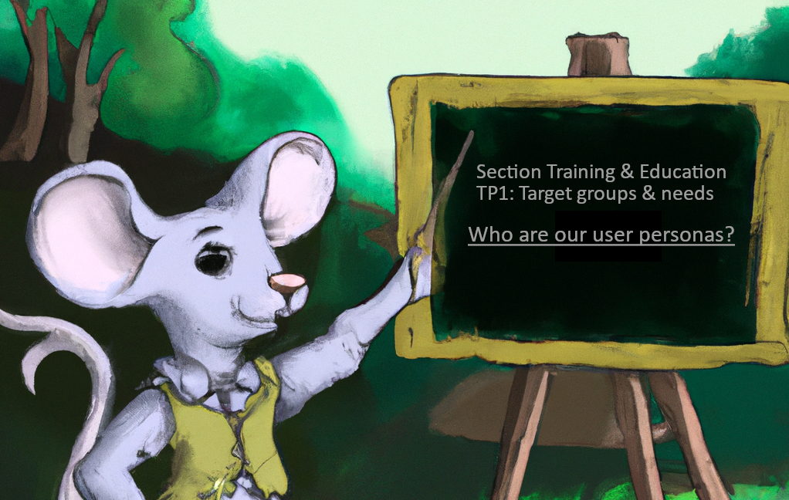

<!--

author:   Britta Petersen
email:    b.petersen@rz.uni-kiel.de
version:  1.0
language: en
narrator: UK English Female

icon:     images/dalia-logo.png

comment:  Short presentation on persona development process EduTrain Express 2024-02-16

-->

# Persona development activities

<center></center>

<div style="page-break-after: always;"></div>

Brief update on persona development activities (AP1/DALIA)
---

## What is a persona?

> <!-- width="100px" align="right" -->
>
>The **persona method** has its **origin** in the field of **software development** and was and still is used for optimizing **human-computer-interactions**.
>
>Today the method is used for various purposes in different fields, most notably in design, marketing, and user-centered development processes.

> “Personas are user archetypes that characterise the needs, goals, technical experience, accessibility requirements and other personal characteristics of larger groups of people.”
>
> -- [Mariana Lilley, Andrew Pyper & Sue Attwood (2012)](https://doi.org/10.11120/ital.2012.11010004)

> “A persona is a fictional character built that models actual users. It’s not a real person; however, it’s built on common characteristics that your learners share.”
>
> -- [Huprich (2019)](https://medium.com/@juliahuprich/building-learner-personas-for-instructional-design-effectiveness-8787d4e5d1d2)

> “The idea: Instead of assuming an anonymous mass, people with concrete names, professions, hobbies, habits, values, etc. are created.”
>
> -- [NFDI4Biodiversity](https://www.nfdi4biodiversity.org/en/personas/)

<div style="page-break-after: always;"></div>

## Why personas?

>**Personas can in general can help us in developing, maintaining and improving EduTrain services**:
>
> <!-- width="100px" align="right" -->
>
>-> **User-Centered Design**: Personas can help to design services, systems and learning offers, having the end users in mind. By creating detailed and relatable profiles of target users, we can better understand user needs, behaviors, and preferences.
>
>->  **Empathy and Understanding**: Personas provide a human face to abstract user groups. They can help us to empathize with users and their goals, motivations and pain points, leading to better designs and decision-making.
>
>-> **Communication**: Personas can simplify communication. Instead of referring to vague user groups, personas provide a concrete reference point. They can enable us to share a common understanding of who the users are and what they want. Personas can also be used to tailor messages and campaigns to specific user groups.
>
>-> **Prioritization**: We may identify primary, secondary, and tertiary user types. This might help us to prioritize features, functionalities, and improvements based on the needs and goals of the most important user segments.
>
>-> **Testing and Validation**: Personas can be used to guide usability testing and validation efforts. Thus personas can be used to create realistic scenarios for testing, ensuring that user interactions and feedback are relevant to the intended audience.
>
>-> **Cross-Functional Collaboration**: Personas may also help in encouraging collaboration as shared personas ensure everyone works towards a common understanding of the user base.

<div style="page-break-after: always;"></div>

## Personas vs. Use Cases vs. User Stories

| User Persona | Use Case* | User Story* |
| -------- | -------- | -------- |
| A user persona is a **fictitious person** who **represents** a **specific target group**.| A use case contains **complete and lengthy descriptions**.|The user story contains **simplified and short descriptions**.|
| It is created for a **better understanding of a specific target group** and **serves as a basis** for discussions of use cases and user stories.|It is designed to provide a detailed description, e.g. of **how a system should work**.|It is used to capture the **requirements** of a project in a **simple and concise way**. |
|      |Usually much longer than User Stories, as a use case provides a **detailed description** of how a system should work.|It is typically written in one or two sentences and is **easy to read and understand**.|
|      |Mostly represented in a **"flowchart" style diagram** |The standard format for user stories is **"As a [role], I desire [objective] so that [benefit]."** |
|      |Use cases are more focused on the **system's functionalities** to build it more effectively | User stories are more focused on the **user's experience**. |

*Table contents based on [Use Case vs User Story: Everything You Need to Know](https://www.knowledgehut.com/blog/agile/use-cases-how-are-they-different-from-user-stories-how-to-create-them)
<div style="page-break-after: always;"></div>


## Development process

<!-- style="width: 80%;background-color: palegrey;"-->
``` ascii
.----------------------------------------------------------------------.
|Research & preparation: Collection & reviewing of existing target  🕵️‍♀️ |
|group descriptions, archetypes and personas in NFDI consortia.        |
|decision on core personas, template development, workshop concept     |
.----------------------------------------------------------------------.
                                  |
                                  V                               
.----------------------------------------------------------------------.
| Co-creation process I                                             👥 | 
| .-----------------------------.  .---------------------------------. |  
| |Community WS 1            👥 |  | Community WS 2               👥 | | 
| |-----------------------------|  |---------------------------------| |
| | CoRDI Side Event            |  | DALIA OER WS                    | |
| | 14.09.2023                  |  | 10. 10. 2023                    | |
| '-----------------------------'  '---------------------------------' |
'----------------------------------------------------------------------'
                                  |
                                  V 
.----------------------------------------------------------------------.
| Consolidation: Review workshop results, preparation of            👩‍💻 | 
| consolidated persona descriptions (in preparation)                   |
'----------------------------------------------------------------------'   
                                  |
                                  V
.----------------------------------------------------------------------.
| Co-creation process II                                           👥  | 
| .------------------------------------------------------------------. |  
| |Call4Comments on consolidated persona describtions                | | 
| |(in preparation)                                                  | |
| '------------------------------------------------------------------' |
'----------------------------------------------------------------------'    
                                  |
                                  V
.----------------------------------------------------------------------.
| Consolidation: Resolve comments, preparation of                   👩‍💻 | 
| publication (upcoming)                                               |
'----------------------------------------------------------------------'  
                                  |
                                  V 
.----------------------------------------------------------------------.
| Transfer: Use of personas for EduTrain & DALIA puposes            🏁 |
| continuous further development (upcoming)                            |
'----------------------------------------------------------------------'

```


## EduTrain: Main User Groups

The user group of the section EduTrain and DALIA is diverse. We expect users, from students to PIs, as well as from lecturers to research support staff working at libraries and computer centers or administrative areas.

Due to time constraints, we have reduced the number of user groups to three main groups, of which we would like you to help describe one representative at a time:

1. [**Learners**](https://miro.com/app/board/uXjVMptzbjA=/?moveToWidget=3458764563238869741&cot=14)
2. [**Lecturers**](https://miro.com/app/board/uXjVMptzbjA=/?moveToWidget=3458764563729042924&cot=14)
3. [**Assistants**](https://miro.com/app/board/uXjVMptzbjA=/?moveToWidget=3458764563729192386&cot=14)
3. [**Contributors**](https://miro.com/app/board/uXjVMptzbjA=/?moveToWidget=3458764563930390371&cot=14)

Please visit our Miro-Board and help us to 

1. describe the main user groups, by naming all subgroups who you can think of may fit to the main user groups

2. Please assign existing personas from NFDI consortia

3. leave characterising notes and comments to describe one persona as a representive for each main user group

>Please help us to describe personas/archetypes that characterise the needs, goals, technical experience, accessibility requirements and other personal characteristics of the EduTrain main user groups and take some time to meet them!
>
> --

><center><big><span style="color:#0abaf0" >**Thanks a lot for participating!**</span></big></center>

## Contacts
If you want to join WP 1 and contribute to our work, if you have ideas for us, questions, just would like to have further information or any other issue, please contact us:

**Prof. Dr.-Ing. Peter Pelz**: peter.pelz@fst.tu-darmstadt.de

**Prof. Dr. rer. nat. Sonja Herres-Pawlis**: sonja.herres-pawlis@ac.rwth-aachen.de

**Canan Hastik**: Canan.Hastik@fst.tu-darmstadt.de

**Britta Petersen**: b.petersen@rz.uni-kiel.de